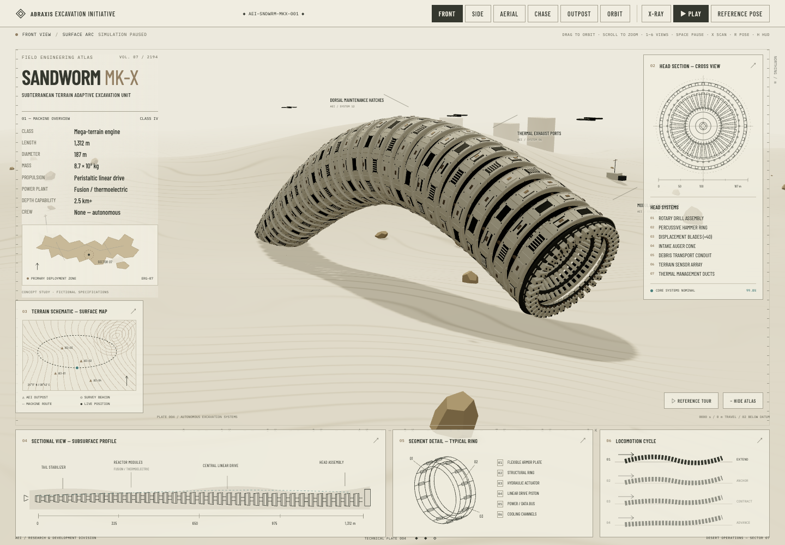

# SANDWORM MK-X

An interactive engineering atlas for the fictional **ABRAXIS Excavation Initiative**.
A procedural excavation machine moves through a real 3D desert: 36 articulated rings,
a hollow radial drill, working joints, surface dust and an underground X-ray view.



## Run

Requires Node.js 22.12+ and npm.

```sh
npm ci
npm run dev
```

Open the address printed by Vite, with `/sandworm/` at the end. The configured base
matches `Hostlife22/sandworm`. If port 5173 is in use, Vite prints another port.

```sh
npm run build
npm run preview
```

All fonts and geometry are local; no API keys, remote models, textures or video
playback are needed. The reference recording is used only for visual study.

## Controls

| Action                                          | Control                   |
| ----------------------------------------------- | ------------------------- |
| Front / Side / Aerial / Chase / Outpost / Orbit | Buttons or `1`–`6`        |
| Rotate / zoom                                   | Drag / scroll or pinch    |
| Pause / resume                                  | `Space`                   |
| Underground X-ray                               | `X`                       |
| Reference pose                                  | `R`; use Play to resume   |
| Hide / show atlas                               | `H` or the visible button |
| Recording camera sequence                       | Reference tour            |

Pause freezes the body, drill, particles and technical indicators. The camera stays
interactive. Dragging interrupts automatic camera movement; selecting a camera
restores it. Tracking views follow the body; Outpost remains fixed so the machine
passes through its view. New camera commands interpolate from the current view. X-ray changes
neither time nor camera.

The tour repeats the recording's 78.583-second camera and scan sequence. It follows
the current kinematic phase, so matching camera timestamps do not imply matching
source frames. [Reference study and state map](docs/REFERENCE_STUDY.md).

## Mechanics

- A cached 4096-sample arc-length lookup moves the head along a fixed world route
  at 5 scene units per second. Each ring follows the positions the head passed.
  A traveling compression wave changes their spacing within bounded limits.
- Stable tangent frames orient segments. Inter-ring rods join transformed attachment
  points; deep dark frames, bevelled plates, hatches, vents, bolts, pipes and tail fins
  use shared geometry and instanced batches.
- The head contains concentric metal rims and 40 rotating radial ribs with a deep,
  open center. UV-attached scratches, panel roughness and sand staining are deterministic.
- The path produces breaching, a surface arc, ploughing, sequential diving and fully
  underground traversal. The body is never scaled away to simulate burial.
- Displaced dune geometry, CPU contact tests and X-ray fragments share one terrain
  equation. Fine ripple shading adds detail without excessive mesh density.
- The X-ray pass uses the same instance matrices as the visible model. It discards
  above-ground fragments, ignores terrain depth and draws translucent cyan geometry.
  A stencil mask preserves the ordinary materials of visible above-ground machinery.
  Ordinary opaque rendering provides terrain occlusion when scanning is off.
- A bounded pool of 220 soft dust particles spawns only at surface intersections.
  Stations, rocks, distant installations and drones provide scale.
- SVG maps, drawings and indicators consume the same simulation. Callouts follow
  model nodes and fade with distance, offscreen position, burial and occlusion.

## Architecture

```text
src/
  App.tsx                  Composition and initial reduced-motion preference
  simulation/
    config.ts              Typed specifications, cameras and reference tour
    Simulation.ts          Commands, UI store, clock, arc-length solver, poses
    Trajectory.ts          Closed world route and cached arc-length lookup
    terrain.ts             Shared terrain equation and deterministic random seed
  scene/
    Scene.tsx              Canvas, lighting, fog, loading and WebGL fallback
    Machine.tsx            Instanced armor, frame, drill and articulated rods
    geometry.ts            Reusable bevelled annular geometry
    materials.ts           Physical materials and subsurface scan shader
    surfaceTexture.ts      Deterministic panel wear and roughness texture
    Terrain.tsx            Displaced mesh and procedural ripple shading
    Environment.tsx        Stations, drones, rocks and distant structures
    Dust.tsx               Bounded contact particle pool
    CameraRig.tsx          Six views, smoothing and input interruption
    Callouts.tsx           Projected labels and conservative occlusion
  ui/                      Controls, atlas layout and local SVG diagrams
  styles.css               Tokens, desktop atlas and mobile document layout
```

Per-frame state is mutable and outside React. `useSyncExternalStore` subscribes only
to UI commands. The renderer caps DPR at 1.5 and shadows at 1024²; tiny fasteners are
culled for distant views. Foreground frames up to five seconds retain elapsed time;
long suspension gaps and time spent in hidden tabs are discarded. Dev builds expose `window.__SANDWORM__` for deterministic captures;
production builds do not expose it.

## Checks

```sh
npm run format          # Apply Prettier
npm run format:check    # Check formatting
npm run lint
npm run typecheck
npm test
npx playwright install chromium
npm run test:e2e
npm run check           # Format check + lint + types + unit tests + build
```

Playwright uses a dedicated port, 5186, and captures eleven reference views under
`docs/screenshots/`. Tests include keyboard input, pause/resume, reduced motion,
WebGL fallback, mobile overflow and travel past a stationary camera. Pure tests cover segment spacing, quaternions,
continuity, repeatable poses, frame-rate-independent travel, head/tail path agreement,
terrain mask accuracy and tour commands.

[Validation and visual comparison](docs/VALIDATION.md) records actual results and
limitations. [Motion and materials review](docs/MOTION_REVIEW.md) explains the
forward-travel correction and includes a fixed-camera comparison. GitHub CI runs `npm ci`, all quality checks and Chromium tests. Successful checks on `master` automatically call **Publish GitHub Pages** and
deploy `/sandworm/`. Pull requests run checks without publishing. The Pages workflow
can also be started manually; GitHub Actions must be selected as the Pages source.

## Accessibility

Semantic controls include pressed states, visible focus and descriptive names.
A skip link reaches the labeled viewport. Hotkeys ignore editable fields and
modified keystrokes; focused buttons retain their native keyboard behavior.
Reduced-motion users start in a static reference pose and explicitly press Play to
animate. Camera transitions become immediate under that preference.

On phones, the scene has its own gesture area; specifications and diagrams follow
in the scrollable document. Camera, X-ray and playback controls remain above the
scene. The viewport handles drag/pinch; scroll on the surrounding document to read
panels. Loading, rendering failure and missing-WebGL states include readable text.
There are no modal panels requiring focus trapping or focus restoration.

The fine atlas labels intentionally use technical plate typography on desktop;
mobile labels are enlarged. This is not a full WCAG audit.

## Limitations

This is a procedural interpretation, not an exact recovered model from the video.
The trajectory is an analytic periodic demonstration, not soil mechanics or a
navigation system. The machine travels a closed route through the finite desert
and does not excavate a persistent tunnel. Transparent scanning is a technical overlay, not
volumetric tomography; overlapping internal parts accumulate opacity. Dust is a
bounded visual effect, not granular physics. See the validation report for measured
performance and remaining visual differences.

## License

[MIT](LICENSE), copyright © 2026 **hostlife22**, confirmed by the repository owner.
The supplied reference video and third-party dependencies are excluded from this
grant. Bundled Barlow Condensed and IBM Plex Mono fonts retain their OFL licenses
in their `@fontsource` packages and in `public/licenses/`. This fictional concept has no affiliation with Dune
rights holders.

## Project policies

- [Contributing](CONTRIBUTING.md)
- [MIT license](LICENSE)
- [Security](SECURITY.md)
- [Accessibility](ACCESSIBILITY.md)
